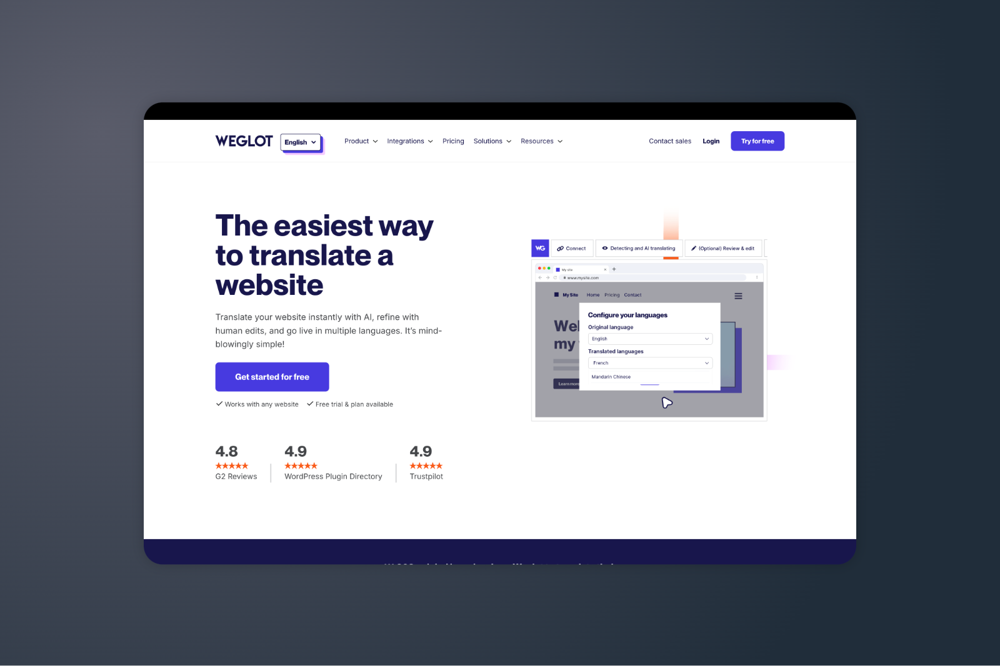
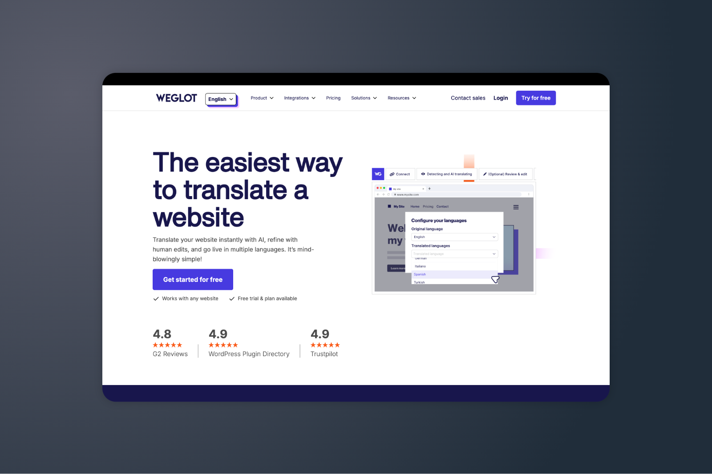

# Weglot Landing Page Clone

This project is a clone of the [Weglot website's landing page](https://www.weglot.com/) created for practicing HTML and SCSS skills.

## Project Overview

This is a practice project aimed at improving front-end development skills by recreating the Weglot landing page. Weglot is a website translation solution, and their landing page offers a great opportunity to practice modern web design techniques.

## Screenshots

### Original Inspiration


### My Clone Implementation


## Technologies Used

- HTML5
- SCSS (Sass)
- CSS3

## Project Structure

```
├── index.html           # Main HTML file
├── style.scss           # Main SCSS file that imports partials
├── style.css            # Compiled CSS file
├── style.css.map        # Source map for debugging
├── _variables.scss      # SCSS variables
├── _navigation.scss     # Navigation styles
├── _main.scss           # Main content styles
├── _footer.scss         # Footer styles
├── Weglot Logo.svg      # Logo image
├── arrow.svg            # Arrow icon
├── checkmark.webp       # Checkmark icon
├── main.png             # Main hero image
├── inspo.png            # Original website screenshot for reference
└── clone.png            # Screenshot of the clone implementation
```

## Learning Objectives

- Practice HTML5 semantic markup
- Implement modern CSS layouts using SCSS
- Create responsive design
- Replicate professional-grade UI components

## Getting Started

1. Clone this repository
2. Open `index.html` in your browser to view the page
3. To make changes to styles, edit the `style.scss` file and compile it to CSS

## Disclaimer

This is a learning project created for educational purposes only. All rights to the original design belong to Weglot (https://www.weglot.com/).